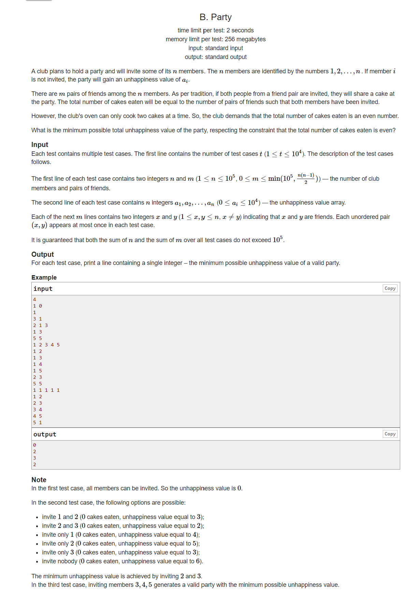

:::tip
    STL,思维题,复杂问题简单转化
:::



    邀请n个人，有m对朋友，蛋糕只能做偶数个（只能邀请偶数对朋友）。
    是朋友就吃蛋糕，不是朋友就不吃。
    没有被邀请会涨不幸福度，问最少不幸福度是多少？

    一开始尝试过结构体或者二维数组来存关系，但是会空间溢出，开不了那么大，所以应该用vector来存朋友关系，size()就是这个人有多少朋友。

    不需要想太复杂，最好情况m为偶数，都邀请输出0。
    m为奇数可以不邀请1个或者2个，最多不邀请2个，判断一下哪种情况结果最小。
    不邀请1个有奇数个朋友关系的人，或者不邀请2个有偶数个朋友关系的人。
```
#include<bits/stdc++.h>//cf 1711B
using namespace std;
const int maxn=1e5+7;
#define ll long long
#define buff  ios::sync_with_stdio(false);cin.tie(0),cout.tie(0);
int a[maxn];
vector<int> v[maxn];
struct node{
	int l,r;
}e[maxn];//存朋友 
int main()
{
	buff;
	int t;
	cin>>t;
	while(t--){
		int n,m;
		cin>>n>>m;
		for(int i=1;i<=n;i++)
		{
			cin>>a[i];
		}
		for(int i=1;i<=n;i++)
		{
			v[i].clear();
		}
		int temp=m;
		int cnt=0;
		if(m%2!=0)
		{
			while(temp--)
			{
				int x,y;
				cin>>x>>y;
				e[++cnt].l=x;
				e[cnt].r=y;
				v[x].push_back(y);
				v[y].push_back(x);
			}
			int ans=0x3f3f3f3f;
			for(int i=1;i<=cnt;i++)
			{
				int l=v[e[i].l].size()%2;
				int r=v[e[i].r].size()%2;
				if(l==1)
				{
					ans=min(ans,a[e[i].l]);
				}
				if(r==1)
				{
					ans=min(ans,a[e[i].r]);
				}
				if(l==0&&r==0)
				{
					ans=min(ans,a[e[i].l]+a[e[i].r]);
				}
			}
			cout<<ans<<"\n";
		}
		else
		{
			cout<<0<<"\n";
		}
	}
	return 0;
}
```

