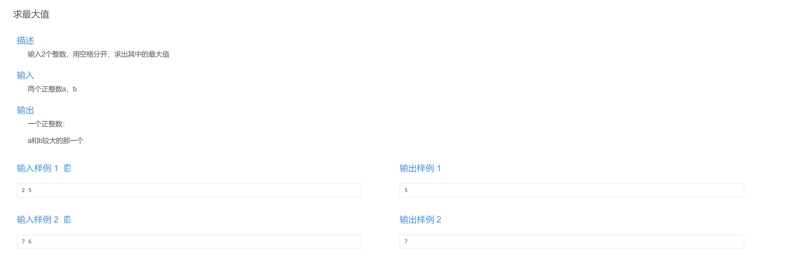
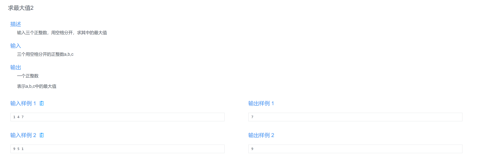
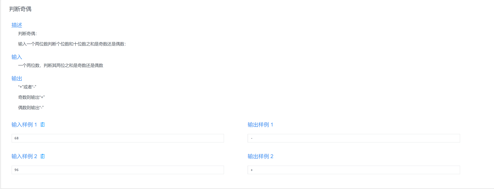
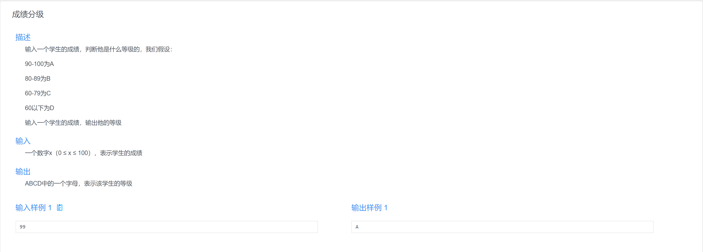
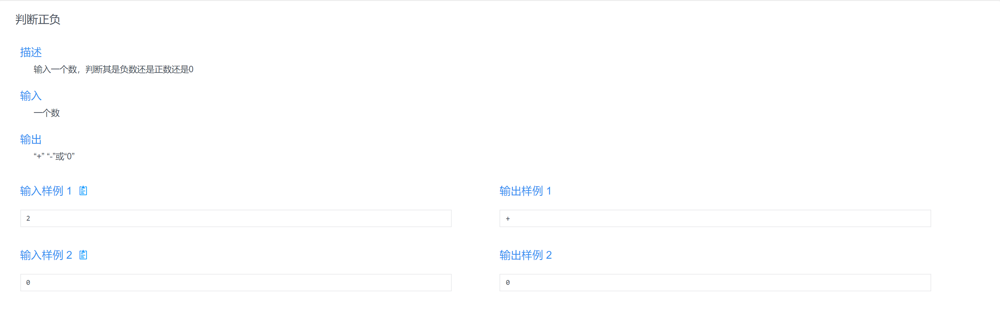

**数媒20-1 彭付广**

:::tip
    顺序结构、选择结构
:::

**顺序结构**

`什么是顺序结构呢？`

我们语文中学过顺叙、倒叙和插叙，不过电脑默认进行的是顺序判断，就是自上而下一行一行运行代码，非常容易理解
```
    //比如以下的代码
    //程序会自上而下逐行顺序运行
    //所以会先输出a，再输出b，最后输出c 
    #include<stdio.h>

    int main()
    {
        int a,b,c;
        scanf("%d %d %d",&a,&b,&c);
        printf("%d",a);
        printf("%d",b);
        printf("%d",c);
        return 0;
    }
```


**选择结构**

`什么是选择结构呢？`

选择结构就是对数据进行一定的判断，如果符合判断的条件则执行一定的语句，如果不满足则继续判断其他的条件，
符合哪个条件就执行对应的语句，如果都不符合就会跳过选择结构这一块不执行。

```
    可以通过两种方式来写选择结构的代码：
        if else 方式
        switch case 方式

    if else 方式：

        if(判断条件)//先对括号里的条件进行判断
        {
            ......//要执行的语句
        }
        else if(判断条件)//如果之前的条件不满足则继续判断这一括号里的条件
        {
            ......
        }
        else if(判断条件)//如果之前的条件不满足则继续判断这一括号里的条件
        {
            ......
        }
        else//如果之前的判断都不满足则执行else里的语句
        {
            ......
        }
    
```

:::tip
    温馨提示：可以只写if不写else 但是不能没有if就写else哦！！！
    而且一组选择结构中else if可以写很多个，但是if和else只能有一个哦！！！
:::


```
    有同学就问了————那么括号内地条件怎么写呢？

    我们也要讲一讲括号里条件的写法

    先介绍几个符号：
    = 赋值符号 比如a=b 是把b的值赋给a 右赋给左
    注意在判断中=不是等于号哦！


    == 相等符号 判断是否相等 
    这个才是正宗的相等哦！
    

    !=不等于 判断是否不相等


    > 大于号 < 小于号
    >= 大于等于号 <= 小于等于号 等号都写在后面


    / 除号 *乘号 %取余(求余数)


    && 与符号(and) 可以理解为并且 &&连起来的一个或多个条件都要满足才行
    比如if(...&&...)
    &&前后的条件都要满足才能执行


    || 或符号(or) 可以理解为或者 ||连起来的一个或多个条件满足一个就行
    比如if(...||...)
    ||前后的条件满足其一就能执行


    在括号里就可以用这些符号写条件判断
```

```
    讲完了if esle 方式
    我们在来讲switch case方式

    switch case方式：

    switch(n)//注意n是要判断的值
    {
        case XXX:......;break;//如果n等于XXX中的值 则执行:后面的语句

        case XXX:......;break;

        case XXX:......;break;

        default:......;break;//如果之前的条件都不满足，则执行default:后面的语句
    }
```

:::tip
    注意每个case后面一定要写break;,不然执行完对应语句段后不会退出的，会继续执行
:::

**好了，接下来是例题部分↓↓↓**


```
    #include<stdio.h>//求最大值 

    int main()
    {
        int a,b;
        scanf("%d %d",&a,&b);
        if(a>b)
        printf("%d",a);
        else printf("%d",b); 
        return 0;
    }
```


```
    #include<stdio.h>//求最大值2 
    int main()
    {
        int a,b,c;
        scanf("%d %d %d",&a,&b,&c);
        int d=0;
        
        if(a>b)
        d=a;
        else d=b;
        
        if(c>d)
        d=c;
        
        printf("%d",d); 
        return 0;
    }   
```


```
    #include<stdio.h>//判断奇偶 
    int main()
    {
        int n;
        scanf("%d",&n);
        int ge=0,shi=0;
        
        ge=n%10;//个位数 
        shi=n/10;//十位数 
        
        if((ge+shi)%2==0)//判断奇偶 
        printf("-");
        else printf("+"); 
        return 0;
    }
```


```
    #include<stdio.h>//成绩分级 if else
    int main()
    {
        int x;
        scanf("%d",&x);
        
        if(x>=90&&x<=100)
        printf("A");
        else if(x>=80&&x<=89)
        printf("B");
        else if(x>=60&&x<=79)
        printf("C");
        else printf("D");
        
        return 0;
    }

    #include<stdio.h>//成绩分级 使用switch 
    int main()
    {
        int x;
        scanf("%d",&x);
        
        int n=x/10;//取x十位上的数 
        switch(n)
        {
            case 10: printf("A");break;
            case 9: printf("A");break;
            case 8: printf("B");break;
            case 7: printf("C");break;
            case 6: printf("C");break;
            default : printf("D");break;
        }
        
        return 0;
    }
```


```
    #include<stdio.h>//判断正负 
    int main()
    {
        int x;
        scanf("%d",&x);
        
        if(x>0)
        printf("+");
        else if(x==0)
        printf("0");
        else
        printf("-");
        
        return 0;
    }
```

**谢谢大家啦！！！**